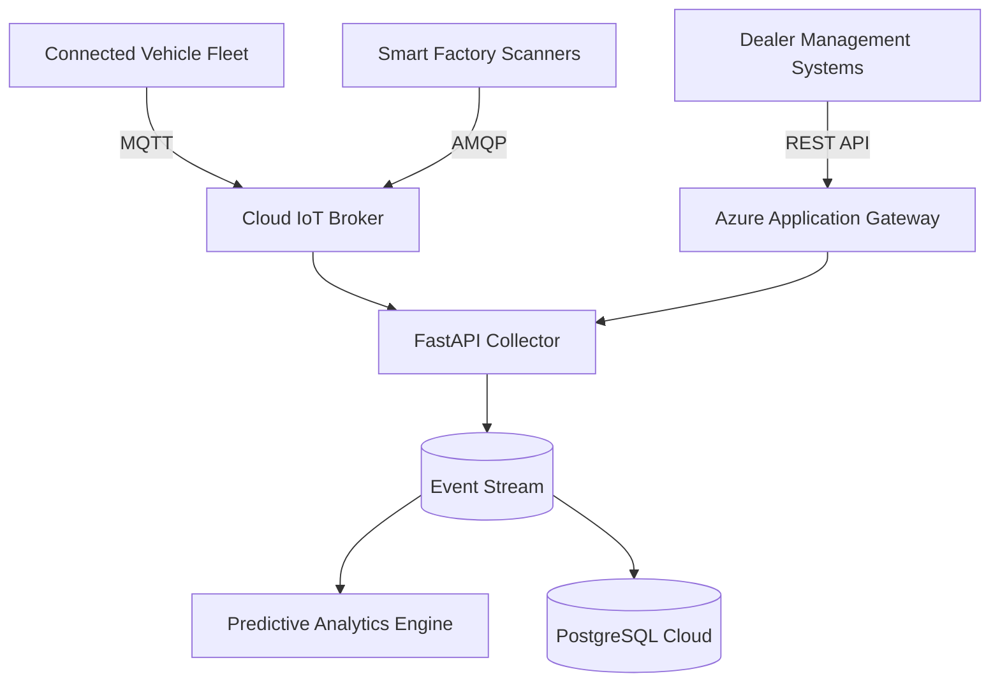
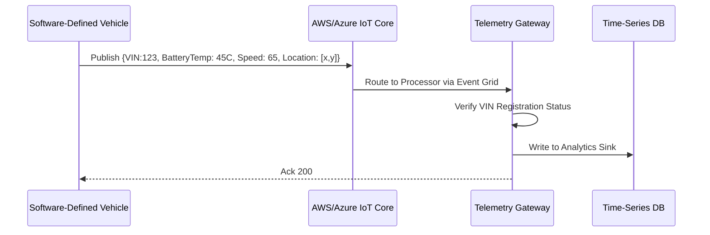
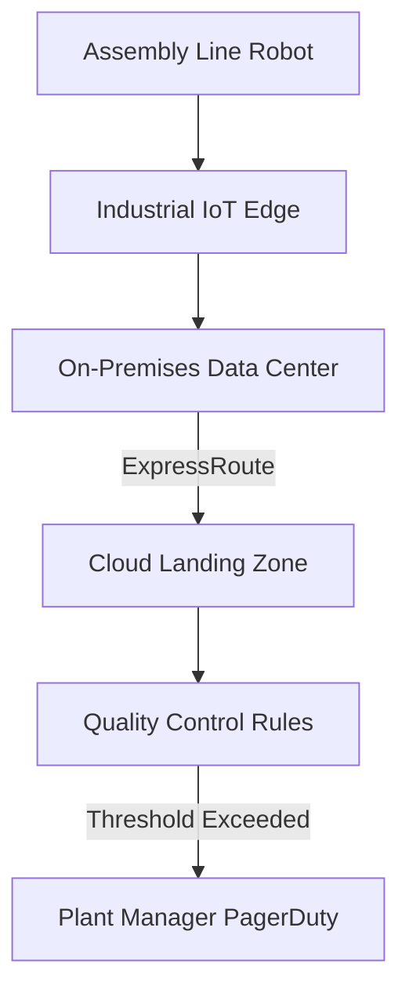
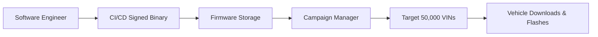
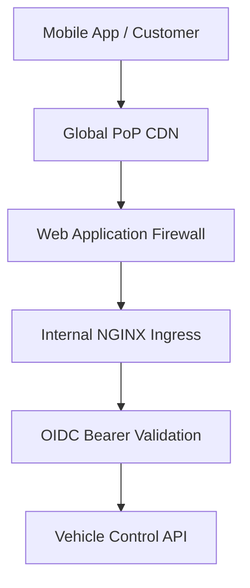
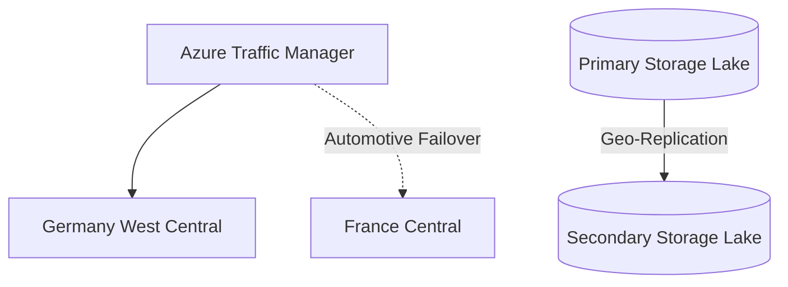

<div align="center">


<h1>Automotive Cloud Landing Zone</h1>

<p><strong>Secure Software-Defined Vehicle (SDV) Data Foundation and Smart Factory Operations</strong></p>

[](https://devopstrio.co.uk/)
[](/k8s)
[](/security)
[](https://devopstrio.co.uk/)

</div>

---

## 🏛️ Executive Summary

The **Devopstrio Automotive Landing Zone** is a global enterprise cloud architecture designed explicitly for Fortune 100 OEMs and Tier-1 Suppliers. It serves as the unified data fabric connecting millions of deployed software-defined vehicles, global dealer arrays, and automated smart-manufacturing EV plants into a single, highly available control plane.

### Strategic Business Outcomes
- **Connected Fleet Telemetry**: Ingests massive volumes of IoT telemetry directly from vehicle CAN buses to predict battery degradation and engine failure before the driver detects a problem.
- **Smart Factory OEE**: Integrates with legacy SCADA networks via Edge gateways to track Overall Equipment Effectiveness (OEE) and identify supply chain bottlenecks on the assembly line.
- **Over-The-Air (OTA) Campaign Management**: Facilitates cryptographically signed firmware updates simultaneously deployed to thousands of vehicles.
- **Regulatory Compliance Default**: Enforces the rigid cyber-security constraints mandated by UNECE WP.29 (R155/R156) and TISAX out-of-the-box.

---

## 🏗️ Technical Architecture Details

### 1. High-Level Automotive Architecture


### 2. Connected Vehicle Data Flow


### 3. Smart Factory Telemetry Lifecycle


### 4. Over-The-Air (OTA) Release Workflow


### 5. API Request Lifecycle


### 6. Disaster Recovery Topology


---

## 🛠️ Global Platform Components

| Engine | Directory | Purpose |
|:---|:---|:---|
| **IoT Connectivity** | `apps/iot-engine/` | Mass ingress of millions of distinct telemetry packets per second from vehicle cellular modules. |
| **Connected App API** | `backend/src/` | Serves the iOS/Android Customer applications (Remote Start, Lock, Charging Status). |
| **Telemetry Sync** | `database/` | Relational tables modeling complex Dealer franchises against VIN supply chain manifests. |
| **Plant Ops Portal**| `apps/portal/` | Executive Next.js interface for real-time factory efficiency logic. |

---

## 🚀 Environment Deployment

Deploy the zero-trust industrial cloud.

```bash
cd terraform/environments/prod
terraform init
terraform apply -auto-approve
```

---
<sub>&copy; 2026 Devopstrio &mdash; Engineering the Future of Mobility.</sub>
